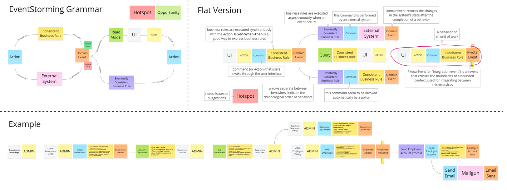

# Event Storming Tool

An interactive web application for facilitating Event Storming sessions - a collaborative modeling technique used in Domain-Driven Design (DDD) to explore complex business domains.



## Features

- **Interactive Canvas**: Create and manipulate diagrams with drag-and-drop functionality
- **Component Types**: Full set of Event Storming elements including:
  - 🟧 Domain Events - Things that happen in the system
  - 🟦 Commands - Actions that trigger events
  - 🟨 Aggregates - Business entities that maintain consistency
  - 🟩 Policies - Business rules that react to events
  - 🟪 Actors - Users or systems that initiate commands
  - ⬜ External Systems - Systems outside your boundary
  - 🟩 Read Models - Views of data used by actors
  - 🟥 Hot Spots - Areas of uncertainty or contention
  - ⬜ UI Components - Interface elements

- **Theme Support**: Switch between light and dark themes
- **Canvas Customization**: Change canvas background color
- **Persistent Storage**: Automatically saves diagrams to localStorage
- **History Management**: Undo/redo functionality
- **Clear Options**: 
  - Clear canvas to start fresh
  - Clear localStorage to reset saved state

## Getting Started

### Prerequisites

- Node.js (v18 or higher recommended)

### Installation

```bash
# Clone the repository
git clone https://github.com/your-org/event-storming.git

# Navigate to project directory
cd event-storming

# Install dependencies
npm install
```

### Running the Application

```bash
# Start development server
npm run dev
```

The application will be available at http://localhost:5173 (or another port if 5173 is in use).

### Building for Production

```bash
# Build for production
npm run build

# Preview production build
npm run preview
```

## Usage

1. **Adding Elements**: Drag components from the sidebar onto the canvas, or click on a component to add it near a selected node
2. **Editing Text**: Double-click on any node to edit its text
3. **Creating Connections**: Drag from one node's edge to another to create connections
4. **Navigation**:
   - Use the mouse wheel to zoom in/out
   - Press 'M' key or click the mode button to toggle between Select and Pan modes
5. **History**:
   - Use the undo/redo buttons to navigate through changes

## Technology Stack

- [React](https://react.dev/)
- [Vite](https://vitejs.dev/)
- [ReactFlow](https://reactflow.dev/) - For interactive node-based UI

## License

This project is licensed under the MIT License - see the LICENSE file for details.

## Acknowledgments

- Event Storming methodology by Alberto Brandolini
- Built by Scyna Team