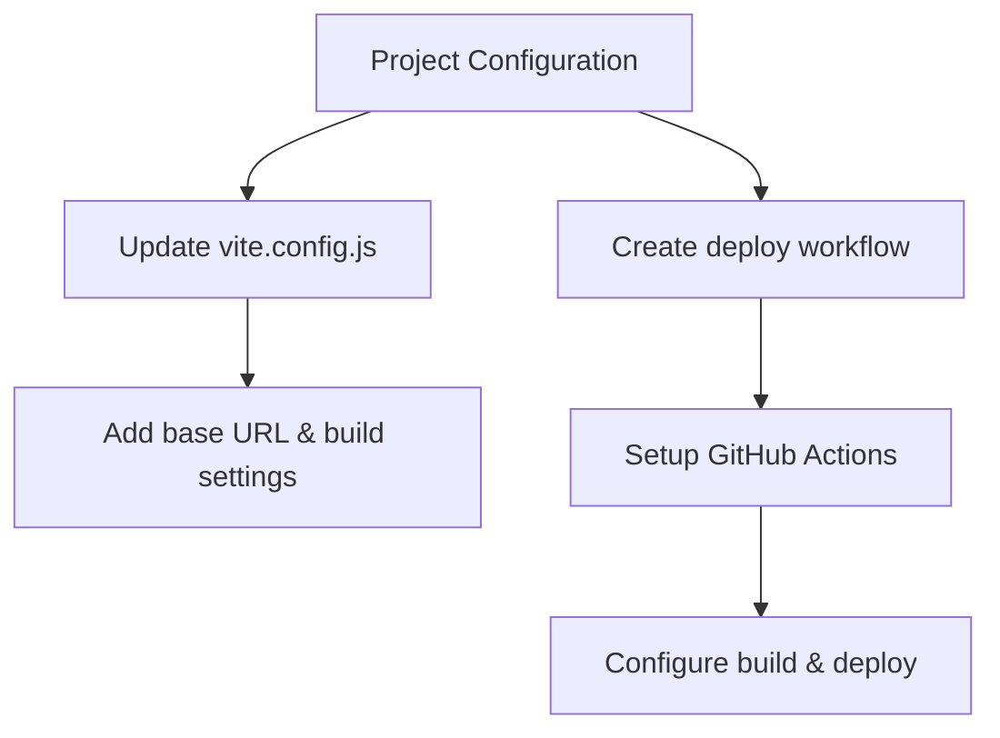
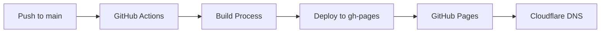
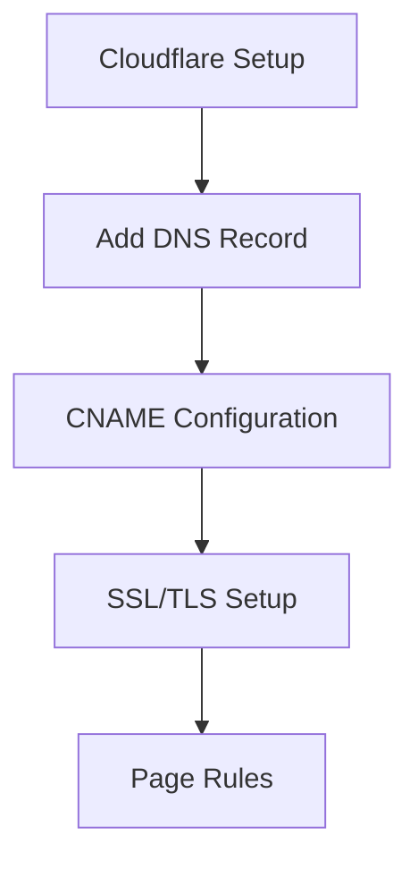

# Kế hoạch triển khai Event Storming lên GitHub Pages và Cloudflare

## 1. Chuẩn bị Project Configuration



### 1.1 Cập nhật Vite Configuration
- Thêm `base` URL cho GitHub Pages
- Cập nhật build configuration để tương thích với GitHub Pages
- Đảm bảo static assets được xử lý đúng cách

### 1.2 Tạo GitHub Actions Workflow
- Tạo workflow để tự động build và deploy
- Cấu hình để trigger khi có push vào branch main
- Setup Node.js environment và caching

## 2. Quy trình Deployment



### 2.1 Build Process
- Install dependencies
- Run build command với Vite
- Tạo static files trong thư mục dist

### 2.2 Deployment Process
- Deploy built files lên branch gh-pages
- Cấu hình GitHub Pages để sử dụng branch gh-pages
- Verify deployment

## 3. Cấu hình Cloudflare



### 3.1 DNS Configuration
- Thêm CNAME record cho subdomain event-storming.khanhnd.com
- Trỏ tới kildo162.github.io
- Cấu hình SSL/TLS

### 3.2 Optimization Settings
- Enable Cloudflare caching
- Configure page rules nếu cần
- Setup SSL/TLS encryption

## Implementation Steps

1. **Project Configuration**
   ```js
   // vite.config.js updates
   base: '/event-storming/'
   ```

2. **GitHub Actions Workflow**
   ```yaml
   # .github/workflows/deploy.yml
   name: Deploy to GitHub Pages
   ```

3. **Cloudflare DNS**
   - CNAME record: `event-storming.khanhnd.com` → `kildo162.github.io`

4. **SSL/TLS**
   - Full (strict) mode
   - Always use HTTPS